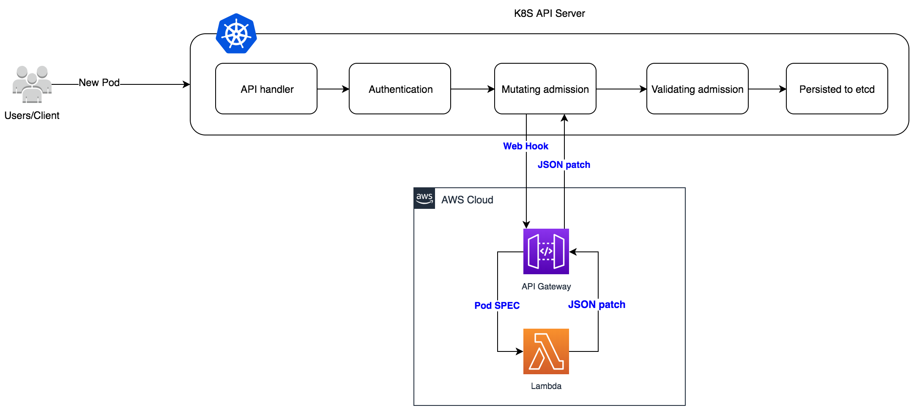

# Amazon API Gateway Mutating Webhook For K8S
This demo project is intended to illustrate how to use [Amazon API Gateway](https://aws.amazon.com/api-gateway/) and [AWS Lambda](https://aws.amazon.com/lambda/) to set up an HTTP service, then been integrated with Kubernetes as [admission webhooks](https://kubernetes.io/docs/reference/access-authn-authz/extensible-admission-controllers/) to receive admission requests and mutate or validate Kubernetes resources dynamically. Particularly this project will setup a mutating webhook to modify the docker image path in K8S Pod after the deployment been submitted to K8S API server and before it's been persisted in etcd.

## Use cases
- The same k8s cluster need to be deployed and use different docker registry, for example k8s cluster deployed in AWS Oregon and Singapore region, and use ECR registry in local region.
- Due to firewall or security restriction, public registry cannot be accessed and need to modify the image path to access other mirrored repositories.

## How to deploy
### Prerequisites
- Make sure that the Kubernetes cluster is at least as new as v1.9.
- Make sure that MutatingAdmissionWebhook admission controllers are enabled.
- Make sure that the admissionregistration.k8s.io/v1beta1 API is enabled.
- If you are using AWS China regions, make sure your AWS account has been whitelisted for API Gateway access, you may contact AWS support for the procedure of the whitelisting.

Amazon EKS has been enabled MutatingAdmissionWebhook.

### Steps to set up admission webhook:
1. Setup webhook with API GW, there are 2 options to build the API GW:
    #### OPTION #1 - Install from SAR(Serverless App Repository)
    This is the recommended approach, deploy it from SAR console:
    |        Region        |                    Click and Deploy                     |
    | :----------------: | :----------------------------------------------------------: |
    |  **ap-northeast-1**  |[](https://deploy.serverlessrepo.app/ap-northeast-1/?app=arn:aws:serverlessrepo:us-east-1:269621987045:applications/amazon-api-gateway-mutating-webhook-for-k8s)|
    |  **ap-east-1**  |[](https://deploy.serverlessrepo.app/ap-east-1/?app=arn:aws:serverlessrepo:us-east-1:269621987045:applications/amazon-api-gateway-mutating-webhook-for-k8s)|
    |  **ap-northeast-2**  |[](https://deploy.serverlessrepo.app/ap-northeast-2/?app=arn:aws:serverlessrepo:us-east-1:269621987045:applications/amazon-api-gateway-mutating-webhook-for-k8s)|
    |  **ap-northeast-3**  |[](https://deploy.serverlessrepo.app/ap-northeast-3/?app=arn:aws:serverlessrepo:us-east-1:269621987045:applications/amazon-api-gateway-mutating-webhook-for-k8s)|
    |  **ap-south-1**  |[](https://deploy.serverlessrepo.app/ap-south-1/?app=arn:aws:serverlessrepo:us-east-1:269621987045:applications/amazon-api-gateway-mutating-webhook-for-k8s)|
    |  **ap-southeast-1**  |[](https://deploy.serverlessrepo.app/ap-southeast-1/?app=arn:aws:serverlessrepo:us-east-1:269621987045:applications/amazon-api-gateway-mutating-webhook-for-k8s)|
    |  **ap-southeast-2**  |[](https://deploy.serverlessrepo.app/ap-southeast-2/?app=arn:aws:serverlessrepo:us-east-1:269621987045:applications/amazon-api-gateway-mutating-webhook-for-k8s)|
    |  **ca-central-1**  |[](https://deploy.serverlessrepo.app/ca-central-1/?app=arn:aws:serverlessrepo:us-east-1:269621987045:applications/amazon-api-gateway-mutating-webhook-for-k8s)|
    |  **eu-central-1**  |[](https://deploy.serverlessrepo.app/eu-central-1/?app=arn:aws:serverlessrepo:us-east-1:269621987045:applications/amazon-api-gateway-mutating-webhook-for-k8s)|
    |  **eu-north-1**  |[](https://deploy.serverlessrepo.app/eu-north-1/?app=arn:aws:serverlessrepo:us-east-1:269621987045:applications/amazon-api-gateway-mutating-webhook-for-k8s)|
    |  **eu-west-1**  |[](https://deploy.serverlessrepo.app/eu-west-1/?app=arn:aws:serverlessrepo:us-east-1:269621987045:applications/amazon-api-gateway-mutating-webhook-for-k8s)|
    |  **eu-west-2**  |[](https://deploy.serverlessrepo.app/eu-west-2/?app=arn:aws:serverlessrepo:us-east-1:269621987045:applications/amazon-api-gateway-mutating-webhook-for-k8s)|
    |  **eu-west-3**  |[](https://deploy.serverlessrepo.app/eu-west-3/?app=arn:aws:serverlessrepo:us-east-1:269621987045:applications/amazon-api-gateway-mutating-webhook-for-k8s)|
    |  **me-south-1**  |[](https://deploy.serverlessrepo.app/me-south-1/?app=arn:aws:serverlessrepo:us-east-1:269621987045:applications/amazon-api-gateway-mutating-webhook-for-k8s)|
    |  **sa-east-1**  |[](https://deploy.serverlessrepo.app/sa-east-1/?app=arn:aws:serverlessrepo:us-east-1:269621987045:applications/amazon-api-gateway-mutating-webhook-for-k8s)|
    |  **us-east-1**  |[](https://deploy.serverlessrepo.app/us-east-1/?app=arn:aws:serverlessrepo:us-east-1:269621987045:applications/amazon-api-gateway-mutating-webhook-for-k8s)|
    |  **us-east-2**  |[](https://deploy.serverlessrepo.app/us-east-2/?app=arn:aws:serverlessrepo:us-east-1:269621987045:applications/amazon-api-gateway-mutating-webhook-for-k8s)|
    |  **us-west-1**  |[](https://deploy.serverlessrepo.app/us-west-1/?app=arn:aws:serverlessrepo:us-east-1:269621987045:applications/amazon-api-gateway-mutating-webhook-for-k8s)|
    |  **us-west-2**  |[](https://deploy.serverlessrepo.app/us-west-2/?app=arn:aws:serverlessrepo:us-east-1:269621987045:applications/amazon-api-gateway-mutating-webhook-for-k8s)|
    |  **cn-north-1**  |[](https://console.amazonaws.cn/lambda/home?region=cn-north-1#/create/app?applicationId=arn:aws-cn:serverlessrepo:cn-north-1:086750097665:applications/amazon-api-gateway-mutating-webhook-for-k8s)|
    |  **cn-northwest-1**  |[](https://console.amazonaws.cn/lambda/home?region=cn-northwest-1#/create/app?applicationId=arn:aws-cn:serverlessrepo:cn-north-1:086750097665:applications/amazon-api-gateway-mutating-webhook-for-k8s)|


    #### OPTION #2 - Build from scratch
    Firstly please install AWS CLI and SAM CLI by following [AWS SAM documentation](https://docs.aws.amazon.com/serverless-application-model/latest/developerguide/serverless-sam-cli-install.html)
    
    1). Check out this repository 

    ```sh
    $ git clone https://github.com/aws-samples/amazon-api-gateway-mutating-webhook-for-k8.git
    $ cd amazon-api-gateway-mutating-webhook-for-k8
    ```

    2). Build the SAM package, replace my_s3_bucket with your S3 bucket name at first.

    ```sh
    $ export S3_BUCKET=my_s3_bucket
    $ sam package -t sam-template.yaml --s3-bucket ${S3_BUCKET} --output-template-file packaged.yaml
    ```

    3). Deploy SAM package

    ```sh
    $ sam deploy -t packaged.yaml --stack-name amazon-api-gateway-mutating-webhook-for-k8 --capabilities CAPABILITY_IAM
    ```
2. Go to the cloudformation stack console, find the stack which name is serverlessrepo-amazon-api-gateway-mutating-webhook-for-k8s if you are are using SAR deployment in previous step, or find the stack with name amazon-api-gateway-mutating-webhook-for-k8, get APIGatewayURL from the outputs of this stack.

3. Create k8s MutatingWebhookConfiguration resource
    - Modify mutating-webhook.yaml，replace <WEB-HOOK-URL> with the value of APIGatewayURL
    - Create K8S resource:
        ```bash
        $ kubectl apply -f mutating-webhook.yaml
        ```
4. Deploy sample k8s deployment
    ```bash
    $ kubectl apply -f ./nginx-gcr.yaml
    ```
5. Check the image path 
    ```bash
    $ kubectl get pod nginx-gcr-deployment-784bf76d96-hjmv4 -o=jsonpath='{.spec.containers[0].image}'
    asia.gcr.io/nginx
    ```
    you may noticed the image path has been changed from "gcr.io/nginx" to "asia.gcr.io/nginx"

## How it works

The most famous use case of k8s mutating webhook is the [istio sidecar injector](https://istio.io/docs/reference/commands/sidecar-injector/), you may also reference [K8S documentation](https://kubernetes.io/docs/reference/access-authn-authz/extensible-admission-controllers/) or [3rd-party blog](https://medium.com/dowjones/how-did-that-sidecar-get-there-4dcd73f1a0a4) to get understand how k8s admission works.

This project will setup the API Gateway with Lambda to receive the admission request from k8s API server, you may get k8s Pod spec from "body" object of request payload json object:
```json
{
    "kind": "AdmissionReview",
    "request": {
        "kind": {
            "kind": "Pod",
            "version": "v1",
            "group": ""
        },
        "resource": {
            "resource": "pods",
            "version": "v1",
            "group": ""
        },
        "uid": "b06b6ec2-681d-11e9-a645-06b44ed6a042",
        "object": {
            "status": {},
            "spec": {
                "dnsPolicy": "ClusterFirst",
                "securityContext": {},
                "serviceAccountName": "default",
                "schedulerName": "default-scheduler",
                "serviceAccount": "default",
                "priority": 0,
                "terminationGracePeriodSeconds": 30,
                "restartPolicy": "Always",
                "containers": [
                    {
                        "name": "nginx",
                        "image": "gcr.io/nginx:latest",
                        "imagePullPolicy": "Always",
                        "ports": [
                            {
                                "protocol": "TCP",
                                "containerPort": 80
                            }
                        ],
                        "resources": {}
                    }
                ]
            },
            "metadata": {
            }
        },
        "namespace": "admission-test",
        "userInfo": {
            "username": "system:unsecured",
            "groups": [
                "system:masters",
                "system:authenticated"
            ]
        },
        "oldObject": null,
        "dryRun": false,
        "operation": "CREATE"
    },
    "apiVersion": "admission.k8s.io/v1beta1"
}
```
then the response of webhook(API Gateway with Lambda) is like this:
```json
{
    "body": {
    "response": {
        "allowed": "True",
        "patch": "patch_base64",
        "patchType": "JSONPatch"
    },
    "headers": {
      "Content-Type": "application/json"
    },
    "statusCode": 200
}
```
where the patch_base64 is base64 encoded of [JSON Patch](http://jsonpatch.com/), for example:
```json
[
    {
        "op": "replace",
        "path": "/spec/containers/0/image",
        "value": "xxxx.dkr.ecr.us-west-2.amazonaws.com/nginx:latest"
    }
]
```
JSON patch will be applied to the Pod spec and then persisted into etcd.

## License Summary

This sample code is made available under the MIT-0 license. See the LICENSE file.
